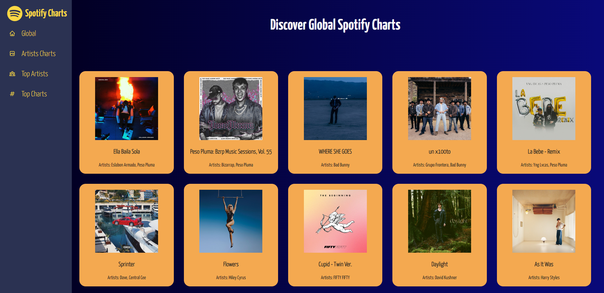

# Spotify Charts



---

### Table of Contents

- [Description](#description)
- [How To Use](#how-to-use)
- [API References](#api-references)
- [License](#license)
- [Author Info](#author-info)

---

## Description

This is a web app that lists information about popular song tracks and artists including their biography, related song information obtained from Spotify 

#### Technologies

- React JS
- Redux Toolkit
- React Router

[Back To The Top](#spotify-charts)

---

## How To Use

The website is published at [Spotify Charts](https://spotify-charts.netlify.app/)

Clone the project 

```bash
  git clone https://github.com/pras306/spotify-charts.git
```

Go to the project directory

```bash
  cd spotify-charts
```

Install dependencies

```bash
  npm install
```

Start the server

```bash
  npm run start
```


[Back To The Top](#spotify-charts)

---

## API References

- [Spotify API](https://rapidapi.com/airaudoeduardo/api/spotify81)
- [Spotify Scraper API](https://rapidapi.com/DataFanatic/api/spotify-scraper)
- [Spotify API](https://rapidapi.com/Glavier/api/spotify23)
- Custom Proxy Server for hiding API key - [https://api-proxy-server-6xbe.onrender.com/api/v1](https://api-proxy-server-6xbe.onrender.com/api/v1)


#### GET top Global tracks

```http
  GET /spotify/top_200_tracks/${date}
```

| Parameter     | Type     | Description                                                      |
| :-----------  | :------- | :--------------------------------------------------------------- |
| `date`        | `string` | **Required**. the last Thursday's date from current date         |


[Back To The Top](#spotify-charts)


#### GET top tracks by Monthly Listeners

```http
  GET /spotify/top_20_by_monthly_listeners
```


[Back To The Top](#spotify-charts)


#### GET top tracks by Followers

```http
  GET /spotify/top_20_by_followers
```


[Back To The Top](#spotify-charts)


#### GET single track details

```http
  GET /spotify/tracks/${songId}
```

| Parameter     | Type     | Description                                                      |
| :-----------  | :------- | :--------------------------------------------------------------- |
| `songId`      | `string` | **Required**. Spotify ID of the required song                    |


[Back To The Top](#spotify-charts)


#### GET single track's lyrics details

```http
  GET /spotify/track_lyrics/${songId}
```

| Parameter     | Type     | Description                                                      |
| :-----------  | :------- | :--------------------------------------------------------------- |
| `songId`      | `string` | **Required**. Spotify ID of the required song                    |


[Back To The Top](#spotify-charts)


#### GET artist's overview details

```http
  GET /spotify/artist_overview/${artistId}
```

| Parameter     | Type     | Description                                                      |
| :-----------  | :------- | :--------------------------------------------------------------- |
| `artistId`    | `string` | **Required**. Spotify ID of the required artist                  |


[Back To The Top](#spotify-charts)


#### GET top tracks by rank

```http
  GET /spotify/chart/tracks/top
```


[Back To The Top](#spotify-charts)


#### GET top artists by rank

```http
  GET /spotify/chart/artists/top
```


[Back To The Top](#spotify-charts)

---

## License

MIT License

Copyright (c) [2021] [Prasanna Sriram]

Permission is hereby granted, free of charge, to any person obtaining a copy
of this software and associated documentation files (the "Software"), to deal
in the Software without restriction, including without limitation the rights
to use, copy, modify, merge, publish, distribute, sublicense, and/or sell
copies of the Software, and to permit persons to whom the Software is
furnished to do so, subject to the following conditions:

The above copyright notice and this permission notice shall be included in all
copies or substantial portions of the Software.

THE SOFTWARE IS PROVIDED "AS IS", WITHOUT WARRANTY OF ANY KIND, EXPRESS OR
IMPLIED, INCLUDING BUT NOT LIMITED TO THE WARRANTIES OF MERCHANTABILITY,
FITNESS FOR A PARTICULAR PURPOSE AND NONINFRINGEMENT. IN NO EVENT SHALL THE
AUTHORS OR COPYRIGHT HOLDERS BE LIABLE FOR ANY CLAIM, DAMAGES OR OTHER
LIABILITY, WHETHER IN AN ACTION OF CONTRACT, TORT OR OTHERWISE, ARISING FROM,
OUT OF OR IN CONNECTION WITH THE SOFTWARE OR THE USE OR OTHER DEALINGS IN THE
SOFTWARE.

[Back To The Top](#spotify-charts)

---

## Author Info

- Github - [pras306](https://github.com/pras306)
- LinkedIn - [Prasanna Sriram](https://www.linkedin.com/in/prasanna-sriram/)
- Portfolio - [Personal Portfolio](https://prasanna-sriram.netlify.app/)

[Back To The Top](#spotify-charts)